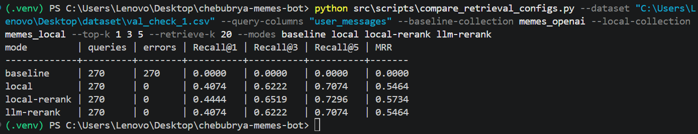

# chebubrya-memes-bot

 index memes
```
python src\scripts\index_memes.py --dataset "C:\Users\Lenovo\Desktop\dataset\check_1.csv" --image-column "image_path" --text-columns "embedding_text" "ocr_text" "semantic_description" --reset
```

finetuned retrieval
```
python src\scripts\evaluate_retrieval.py --dataset "C:\Users\Lenovo\Desktop\dataset\val_check_1.csv" --query-columns "user_messages" --top-k 1 3 5
```

finetuned retrieval + finetuned reranker
```
python src\scripts\evaluate_retrieval_rerank.py --dataset "C:\Users\Lenovo\Desktop\dataset\val_check_1.csv" --query-columns "user_messages" --top-k 1 3 5
```

compare retrieval/rerank configs
```
python src\scripts\compare_retrieval_configs.py --dataset "C:\Users\Lenovo\Desktop\dataset\val_check_1.csv" --query-columns "user_messages" --top-k 1 3 5 --retrieve-k 20 --modes baseline local local-rerank llm-rerank
```

For a fair baseline vs local retrieval comparison, index them into separate Chroma collections and pass them explicitly:
```
python src\scripts\compare_retrieval_configs.py --dataset "C:\Users\Lenovo\Desktop\dataset\val_check_1.csv" --query-columns "user_messages" --baseline-collection memes_openai --local-collection memes_local --top-k 1 3 5
```
